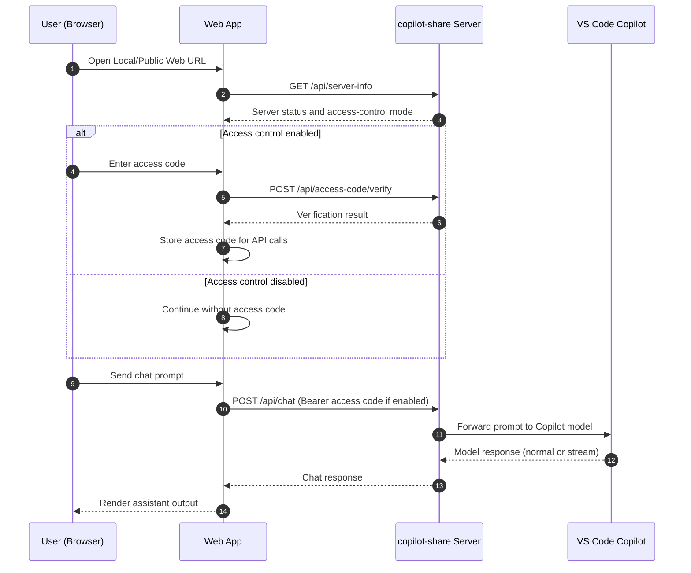

## Table of Contents

- [Overview](#overview)
- [Session-Oriented Workflow](#session-oriented-workflow)
- [Framework](#framework)
  - [1. Deployment Architecture and Data Flow (Client-Host Topology)](#1-deployment-architecture-and-data-flow-client-host-topology)
  - [2. Runtime Request Sequence (Open Web -> Verify Access Code -> Chat)](#2-runtime-request-sequence-open-web---verify-access-code---chat)
- [Operation Guidance](#operation-guidance)
  - [1. Install Extension](#1-install-extension)
  - [2. Host and Manage the Web Hub](#2-host-and-manage-the-web-hub)
  - [3. Usage Example](#3-usage-example)
    - [1. Start the Web Hub](#1-start-the-web-hub)
    - [2. Use the Web Hub Locally](#2-use-the-web-hub-locally)
    - [3. Share the Web Hub on a Local Network](#3-share-the-web-hub-on-a-local-network)
    - [4. Use Copilot in the Web Hub](#4-use-copilot-in-the-web-hub)
      - [4.1 Session Operations](#41-session-operations)
      - [4.2 Conversation Operations](#42-conversation-operations)
    - [5. Stop the Web Hub](#5-stop-the-web-hub)
- [Operation Details](#operation-details)

## Overview
copilot-share is a VS Code extension that brings Copilot from the VS Code IDE to a local web hub, delivering a streamlined user experience with reliable session operations and context management.

It can be accessed across devices on the same local area network (LAN) as the host device running VS Code.
You can also share it with family, friends, coworkers, and team members.

More importantly, copilot-share introduces a session-oriented workflow designed to help teams use Copilot and other LLM products more effectively. (link)

## Session-Oriented Workflow

Traditionally, we used code to build applications and services. As a result, we reviewed code to verify alignment with design goals and business scenarios, as well as runtime reliability (memory/concurrency/I/O), privacy protection, and network safety.

Today, we use prompts to guide LLM models in generating code, documentation, and resource files for implementation.

In this model, prompts play a role similar to source code, and sessions play a role similar to source files.

Prompts and sessions should be treated as core work assets, just like code and source files.

Prompts and sessions should also be reviewed with the same discipline used for code and source files, so we can confirm direction, validate objectives, catch gaps, avoid misleading model output, and reduce the risk of accepting responses that are persuasive but inaccurate.

A session can serve as a deliberate container for multiple prompts aligned to one objective. That is why I call this approach a session-oriented workflow: it provides a structured way to manage complex projects when using prompts to drive LLM-based implementation.

## Framework

### 1. Deployment Architecture and Data Flow (Client-Host Topology)

### 2. Runtime Request Sequence (Open Web -> Verify Access Code -> Chat)

## Operation Guidance
### 1. Install Extension
1. Install copilot-share by searching ".." as shown in the screenshot. (img)
2. After installation is complete, the extension icon appears in the status bar. (img)

### 2. Host and Manage the Web Hub
1. Click the extension icon in the status bar to open the management menu and start or manage the copilot-share web hub. (img)
2. The table below describes the purpose of each menu item. (table)

### 3. Usage Example
#### 1. Start the Web Hub
Click Start to launch the web hub. (img)
copilot-share lets you enable or disable access control for local network (LAN) usage. (img)

#### 2. Use the Web Hub Locally
Click Open Local Web or Open Public Web to use Copilot in a browser on your host device. (img)

#### 3. Share the Web Hub on a Local Network
Click Copy Public URL to access the web hub across devices or share it with family, friends, and team members on the same LAN.
This action also provides a QR code image for quick access. (img)

#### 4. Use Copilot in the Web Hub
Access the web hub to use Copilot through a session-oriented workflow.

##### 4.1 Session Operations
- Easily locate sessions from the session list. (link)
- Reorder sessions by dragging with a mouse on PC, or by long-pressing and swiping on mobile. (link)
- Search messages within a single session or across all sessions. (link)
- Manage each session lifecycle and state: create, rename, delete, pin, and lock. (link)
- Select LLM models based on your needs. (link)
- Export a session (conversation and metadata) and import it later to rebuild across devices. (link)
- Copy a session conversation to the clipboard, or share it as an MD file for review. (link)
- Clone a session for reuse. (link)
- Summarize a session and share the summary to reduce chat noise and focus on key outcomes. (link)
- Clear a session's conversation and context, or clear only the context, for flexible session reuse. (link)
- Rebuild a session's context. (link)

##### 4.2 Conversation Operations
- Right-click a message bubble for either a prompt or an agent response to open context menus for copy, share, favorite, and multi-selection actions. (link)
- Enable historical prompt search to quickly find and reuse similar previous prompts while typing a new one. (link)
- Polish the original prompt to use LLMs more efficiently with a structured input. (link)

#### 5. Stop the Web Hub
Click Stop to shut down the web hub. (img)

## Operation Details

