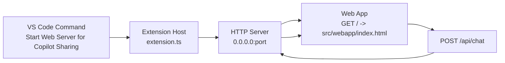

# Copilot Sharing

Copilot Sharing is a VS Code extension that starts a local HTTP server to host a web chat UI and a simple chat API endpoint.

It is designed for user ↔ LLM/Agent style conversations and supports local network sharing so other devices on the same LAN can open the web app.

## Features

- Starts an HTTP server from command palette:
	- `Start Web Server for Copilot Sharing`
- Hosts the web app from:
	- `src/webapp/index.html`
- Exposes API endpoint:
	- `POST /api/chat`
- LAN-ready server behavior:
	- Binds to `0.0.0.0`
	- Detects LAN IPv4 URL(s) and shows one in the startup message
	- Supports copying LAN URL to clipboard
- Port behavior:
	- Uses configurable start port
	- If port is occupied, automatically increments (`+1`) until an available port is found
	- Shows the actual used port after startup

## Architecture Diagram



	### Network Access Paths

	```mermaid
	flowchart LR
		S[HTTP Server\n0.0.0.0:port]
		L[Host machine browser\n127.0.0.1:port] --> S
		N[LAN client device\n192.168.x.x:port] --> S
	```

## Extension Configuration

This extension contributes the following setting:

- `copilot-sharing.port`
	- Type: `number`
	- Default: `6800`
	- Range: `1` to `65535`
	- Meaning: preferred starting port for the web server

If the configured port is unavailable, the extension tries higher ports one by one until startup succeeds.

## How to Use

1. Open Command Palette.
2. Run: `Start Web Server for Copilot Sharing`.
3. In the popup:
	 - choose **Open Web App** to open the app on localhost (`127.0.0.1`), or
	 - choose **Copy LAN URL** to share with another device.
4. Use the copied LAN URL (for example `http://192.168.1.23:6800`) on other clients in the same network.

## API Contract (Current)

### Request

- Method: `POST`
- Path: `/api/chat`
- JSON body (example):

```json
{
	"sessionId": "s1",
	"message": "Hello"
}
```

### Response

```json
{
	"sessionId": "s1",
	"reply": "Server received: Hello",
	"timestamp": 1700000000000
}
```

This default response is a placeholder so you can replace it with real LLM request/response logic.

## Web App Integration Notes

The hosted web app (`src/webapp/index.html`) already supports callback integration:

- implement `window.onUserSend({ sessionId, text })`
- call `window.appendAgentMessage(sessionId, replyText)` when your backend returns

Additional web UI documentation is available in:

- `src/webapp/README.md`

## Troubleshooting

- If other LAN clients cannot access the URL, check OS firewall inbound rules.
- If startup fails, verify your configured port is valid; the extension will try fallback ports automatically.
- If no LAN URL appears, your machine may not currently have an active external IPv4 interface.

## Development

- Build: `npm run compile`
- Watch: `npm run watch`

## Release Notes

### 0.0.1

- Added command-based HTTP server startup
- Added static hosting for `src/webapp/index.html`
- Added `POST /api/chat` placeholder endpoint
- Added LAN URL detection and sharing support
- Added configurable start port (`copilot-sharing.port`) with incremental fallback
