## Table of Contents

- [Overview](#overview)
- [Session-Oriented Workflow](#session-oriented-workflow)
- [Framework](#framework)
  - [1. Deployment Architecture and Data Flow (Client-Host Topology)](#1-deployment-architecture-and-data-flow-client-host-topology)
  - [2. Runtime Request Sequence (Open Web -> Verify Access Code -> Chat)](#2-runtime-request-sequence-open-web---verify-access-code---chat)
- [Operation Guidance](#operation-guidance)
  - [1. Install Extension](#1-install-extension)
  - [2. Host and Manage the Web Hub](#2-host-and-manage-the-web-hub)
  - [3. Usage Example](#3-usage-example)
    - [1. Start the Web Hub](#1-start-the-web-hub)
    - [2. Use the Web Hub Locally](#2-use-the-web-hub-locally)
    - [3. Share the Web Hub on a Local Network](#3-share-the-web-hub-on-a-local-network)
    - [4. Use Copilot in the Web Hub](#4-use-copilot-in-the-web-hub)
      - [4.1 Session Operations](#41-session-operations)
      - [4.2 Conversation Operations](#42-conversation-operations)
    - [5. Stop the Web Hub](#5-stop-the-web-hub)

## Overview
**copilot-share** is a VS Code extension that brings Copilot from the VS Code IDE to a local web hub, delivering a streamlined user experience with reliable session operations and context management.

It can be accessed across devices on the same local area network (LAN) as the host device running VS Code IDE.
You can also share it with family, friends, coworkers, and team members.

More importantly, copilot-share introduces a [session-oriented workflow](#session-oriented-workflow) designed to help teams use Copilot and other LLM products more effectively.

## Session-Oriented Workflow

Traditionally, we used code to build applications and services. Because of that, we reviewed code to ensure it matched design goals and business scenarios, and that it met expectations for runtime reliability (memory/concurrency/I/O), privacy, and network safety.

Today, prompts guide LLMs to generate code, documentation, and resource files.

In this model:
- Prompts are like source code.
- Sessions are like source files.

That means prompts and sessions should be:
- Treated as core work assets, just like code and source files.
- Reviewed with the same level of discipline used for code and source files,
  so we can confirm direction, validate objectives, find gaps early, avoid misleading outputs, and reduce the risk of accepting responses that sound convincing but are inaccurate.

Why call it session-oriented:
- A session is a deliberate container for multiple prompts that serve one objective. This is why I call it a session-oriented workflow: it offers a structured way to manage complex projects when prompts drive LLM-based implementation.

## Framework

### 1. Deployment Architecture and Data Flow (Client-Host Topology)

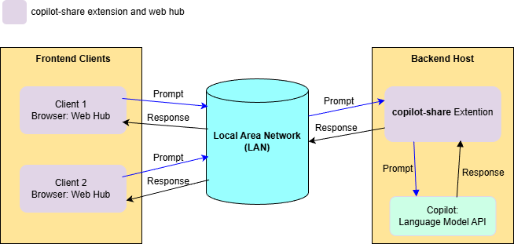

### 2. Runtime Request Sequence (Open Web -> Verify Access Code -> Chat)

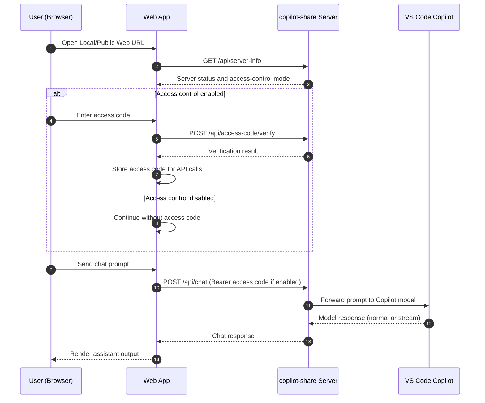

## Operation Guidance
### 1. Install Extension
1. Install copilot-share by clicking the VS Code extensions icon () and searching for `copilot share`.
2. After installation completes, the status bar will show the extension icon ().

### 2. Host and Manage the Web Hub
**1. Click the extension icon () in the status bar to open the control menu window then start and manage the copilot-share web hub.**

- Control Menu Window:
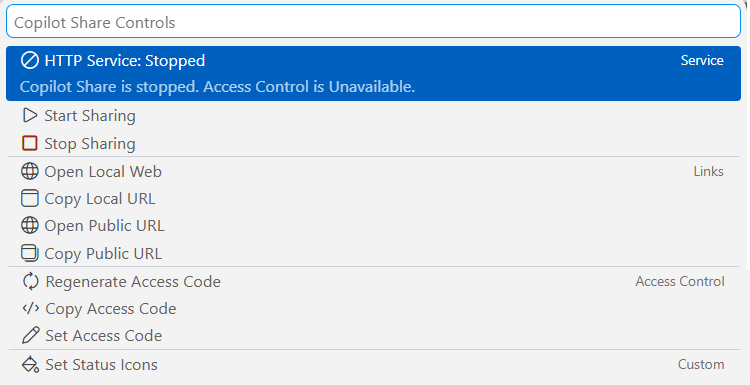

**2. Below describes the purpose of each menu.**

| Menu                 | Purpose |
|----------------------|---------|
| Http Service         | Show the web hub status: running state, port in use, and access control status.|
| Start Sharing        | Start the web hub access control toggled on or off.|
| Stop Sharing         | Stop the web hub.|
| Open Local Web       | Open the web hub at the local URL (`http://127.0.0.1:***/`).|
| Copy Local URL       | Copy the local web hub URL.|
| Open Public Web      | Open the web hub using its LAN-accessible public URL.|
| Copy Public URL      | Copy the public URL and show a QR code for quick access on another device.|
| Regenerate Access Code | Generate a new access code for the web hub.|
| Copy Access Code     | Copy the current access code.|
| Set Access Code      | Manually set the access code.|
| Set Status Bar Icons | Select the status bar icons for the extension.|

### 3. Usage Example
#### 1. Start the Web Hub

1. Click `Start Sharing` in the control menu to start the web hub. 
   - copilot-share lets you enable or disable access control for local network (LAN) usage.
   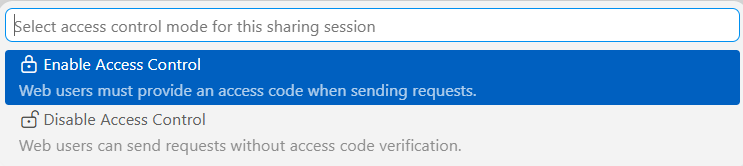

#### 2. Use the Web Hub Locally

##### 2.1 Launch Web Hub

1. Click `Open Local Web` or `Open Public Web` in the control menu to use Copilot in a browser on your host device. 
   - Web Hub UI: 
   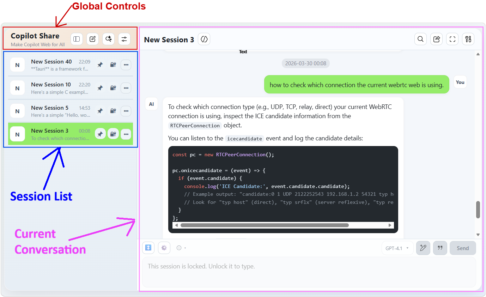

##### 2.2 Global Controls

**1. UI Buttons**
   - 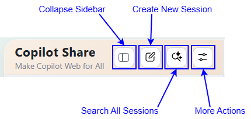
**2. More Actions**
   - 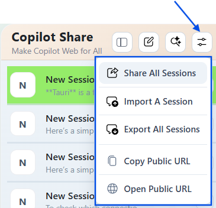

##### 2.3 Session List Interactions

**1. UI Buttons**
   - 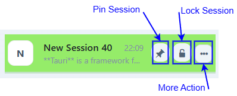
**2. More Actions**
   - 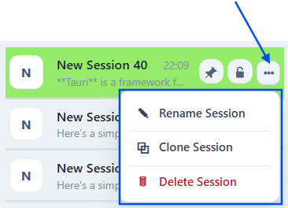

##### 2.4 Current Session Interactions

**1. UI Buttons**
   - 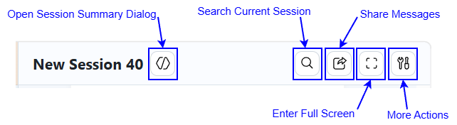
**2. More Actions**
   - 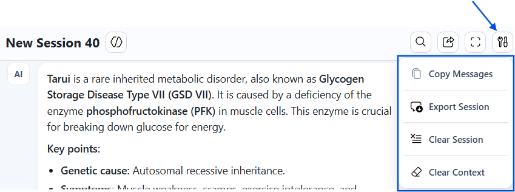
**3. Session Summary Dialog**
   - 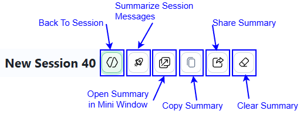
**4. Input Area**
   - 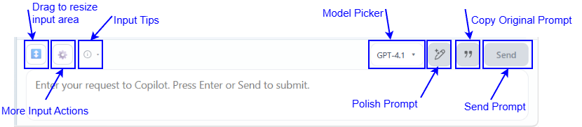
**5. More Input Actions**
   - 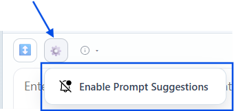

#### 3. Share the Web Hub on a Local Network

1. Click `Copy Public URL` in the control menu to access the web hub across devices or share it with family, friends, and team members on the same LAN.
   - This action also provides a QR code image for quick access. 

#### 4. Use Copilot in the Web Hub
Access the web hub to use Copilot through a session-oriented workflow.

##### 4.1 Session Operations
1. Easily locate sessions from the session list. 
2. Reorder sessions by dragging with a mouse on PC, or by long-pressing and swiping on mobile. 
3. Search messages within the current session or across all sessions. 
4. Manage each session lifecycle and state: create, rename, delete, pin, and lock. 
5. Export a session (conversation and metadata) and import it later to rebuild across devices. 
6. Copy a session conversation to the clipboard, or share it as an MD file for review.
7. Clone a session for reuse. 
8. Summarize a session and manage the summary to reduce chat noise and focus on key outcomes. 
9. Clear a session's conversation and context, or clear only the context, for flexible session clear. 
10. Rebuild a session's context. 

##### 4.2 Conversation Operations
1. Right-click a message bubble for either a prompt or an agent response to open context menus for copy, share, retry, favorite, and multi-selection actions.
2. Enable historical prompt search to quickly find and reuse similar previous prompts while typing a new one.
3. Polish the original prompt to use LLMs more efficiently with a structured input.
4. Select LLM models based on your needs. 

#### 5. Stop the Web Hub
1. Click `Stop Sharing` in the control menu to shut down the web hub. 
