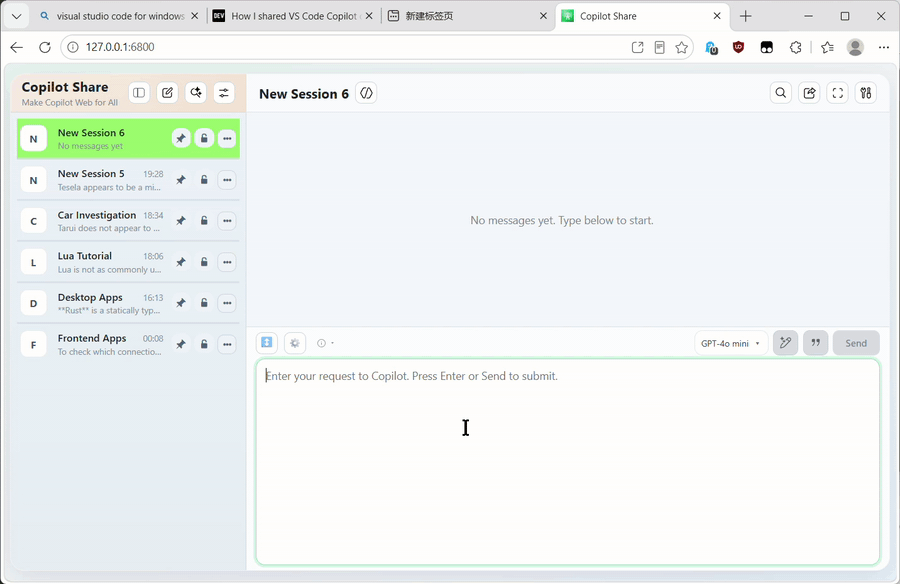

# Copilot Share: Less Prompt Effort, Better AI Results

Great AI outputs start with great prompts. The challenge is that writing high-quality prompts takes time, and most teams can lose efficiency and struggle to maintain momentum before they reach the result quality they need.

The **Prompt Polishing** feature in **[Copilot Share](https://marketplace.visualstudio.com/items?itemName=warlordy.copilot-share)** removes that friction instantly.

Start with a simple, raw prompt, polish it in one click, and turn it into a clearer, richer, more actionable instruction so your AI agent can deliver higher-quality results.

## Why This Matters

- Save prompt engineering time in daily work.
- Improve response quality without extra effort.
- Get more consistent results across different users and tasks.
- Reduce trial-and-error loops when working with AI agents.

## Core Workflow

1. Write a simple  draft prompt.
2. Click the **Polish Prompt** button.
3. Send the polished prompt to the AI agent.
4. Receive more structured and practical responses.

Simple demo: [Prompt Polishing GIF](../src/doc/readme/ai_agent_speed_up_via_prompt_optimization2.gif)



## Real Example: Before vs After

### Model Setup

- Model: `GPT-4o mini`
- Model ID: `copilot-utility-small`

### 1. Original Prompt

```text
explain ai agent
```

### 2. Polished Prompt

```text
Explain what an AI agent is, including its definition, key characteristics, and common applications. Provide examples to illustrate its functionality and how it differs from traditional software agents.
```

### 3. Original Reply (from naive prompt)

```markdown
An AI agent is a software entity that uses artificial intelligence techniques to perform tasks autonomously or semi-autonomously. It can perceive its environment through sensors, make decisions based on its programming and learned experiences, and take actions to achieve specific goals. AI agents can be found in various applications, such as virtual assistants, chatbots, and autonomous vehicles. They often utilize machine learning, natural language processing, and other AI methodologies to improve their performance over time.
```

### 4. Reply After Prompt Polishing

```markdown
An **AI agent** is a software entity that uses artificial intelligence techniques to perform tasks autonomously or semi-autonomously.

#### Definition

An AI agent perceives its environment through sensors, processes information using algorithms, and acts upon that environment through actuators. It can learn from experiences and adapt its behavior over time.

#### Key Characteristics

1. **Autonomy**: Operates independently without human intervention.
2. **Adaptability**: Learns from interactions and improves performance.
3. **Reactivity**: Responds to changes in the environment in real time.
4. **Proactivity**: Takes initiative to achieve goals rather than only reacting to stimuli.
5. **Social Ability**: Communicates and collaborates with other agents or humans.

#### Common Applications

- **Virtual Assistants**: Siri or Alexa style assistants that answer user questions.
- **Recommendation Systems**: Systems used by platforms such as Netflix or Amazon.
- **Autonomous Vehicles**: Self-driving systems that make real-time navigation decisions.
- **Robotics**: Robots in manufacturing and healthcare that adapt to changing conditions.

#### Examples

- **Chatbots**: Conversational agents for support and information tasks.
- **Game AI**: NPC agents that adjust behavior based on player actions.

#### Differences from Traditional Software Agents

- **Learning Capability**: Traditional agents mostly follow predefined rules; AI agents can learn and adapt.
- **Decision-Making Complexity**: AI agents can handle more complex and uncertain scenarios.
- **Interaction Quality**: AI agents support more natural, context-aware interaction.

In short, AI agents represent a major step forward from traditional software agents because they combine autonomy, adaptation, and richer interaction.
```

## Best Use Cases

- Internal productivity tools that rely on AI agents.
- AI-assisted coding, documentation, and analysis workflows.
- Teams onboarding new users who are not prompt experts.
- Workshops and training where fast, reliable outputs matter.
