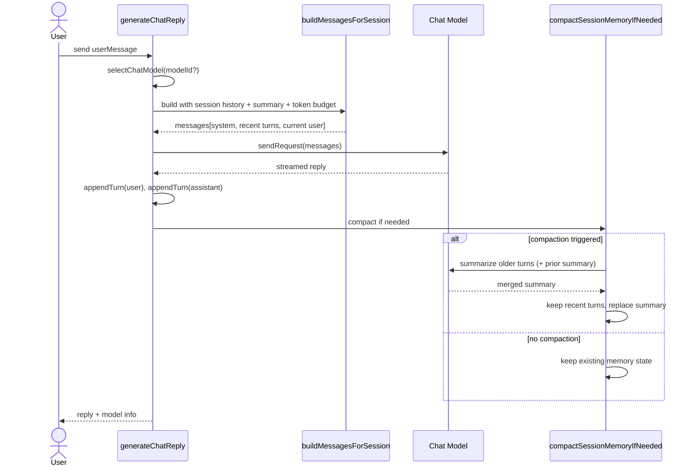

# Chat Context Building Mechanism

This document summarizes how `src/llm.ts` builds chat context, controls token usage, and preserves long-running session memory.

## 1) Session Memory Model

The runtime keeps two in-memory maps per `sessionId`:

- `sessionHistory: Map<string, ConversationTurn[]>`
	- Stores recent raw turns as `{ role: 'user' | 'assistant', content }`.
- `sessionSummaries: Map<string, string>`
	- Stores compact “durable memory” summary of older conversation.

Memory lifecycle:

- `clearSessionHistory(sessionId)` deletes both raw history and summary for that session.
- `clearAllSessionHistory()` clears all sessions (history + summaries).

## 2) Request-Time Context Assembly

Entry point: `generateChatReply(sessionId, userMessage, modelId?)`

Before sending a model request, context is built by:

1. Selecting model via `selectChatModel`.
2. Calling `buildMessagesForSession(sessionId, userMessage, model.maxInputTokens)`.

`buildMessagesForSession` constructs messages in this order:

1. A system-role message (implemented with `LanguageModelChatMessage.User(..., 'system')`).
2. Selected recent history turns (user/assistant role messages).
3. Current user message.

## 3) System Prompt Composition

Base prompt:

- `SYSTEM_PROMPT`: concise assistant behavior + “use conversation history”.

If session summary exists, `buildSystemPrompt(summary)` appends:

- `Conversation memory from earlier turns:`
- Summary bullet content.

Effect: older context is injected as compressed memory without replaying all prior turns.

## 4) Token Budgeting Strategy

Budget is computed by `resolveContextTokenBudget(modelMaxInputTokens)`:

- Defaults to `4096` if model limit is missing/invalid.
- Otherwise computes:
	- `ratioBudget = floor(modelMaxInputTokens * 0.75)`
	- `reservedBudget = modelMaxInputTokens - 1024`
	- Result = `max(1024, min(ratioBudget, reservedBudget))`

Interpretation:

- At most 75% of input window is used for context.
- 1024 tokens are reserved for output headroom.
- Never allow context budget below 1024.

## 5) History Selection Within Budget

`selectHistoryWithinTokenBudget(history, systemPrompt, userMessage, maxContextTokens)`:

- Starts with token usage for:
	- system prompt
	- current user message
	- per-message overhead for those two messages
- Walks history from newest → oldest.
- Adds each turn only if the next turn still fits budget.
- Stops at first overflow.

Token estimation (heuristic):

- `estimateTextTokens(text) = ceil(text.length / 4)`
- Plus fixed `MESSAGE_TOKEN_OVERHEAD = 8` per message.

This gives a simple, stable approximation independent of model tokenizer internals.

## 6) Rolling Summary Compaction

After each successful reply, flow is:

1. Append current user turn.
2. Append assistant turn.
3. Run `compactSessionMemoryIfNeeded(sessionId, model)`.

Compaction trigger conditions:

- History length exceeds recent hard cap (`HISTORY_TURNS_TO_KEEP * 2`, currently 16 messages), and
- Estimated history tokens exceed `70%` of context budget.

When triggered:

- Keep latest `RECENT_TURNS_TO_KEEP_AFTER_SUMMARY * 2` messages (currently 6 messages).
- Summarize older turns with `summarizeConversationHistory`.
- Merge with prior summary by prompting the model with:
	- existing summary
	- new transcript segment
	- instruction to retain only durable facts/decisions/unresolved tasks.
- Replace session summary with merged summary.
- Replace session history with only recent kept turns.

Failure behavior:

- If summary generation fails or returns empty, previous summary is kept and no destructive memory loss occurs.

## 7) Practical Behavior Over Time

- Short chats: mostly raw turns, little/no summarization.
- Long chats: old turns are progressively compressed into summary memory.
- Prompt always includes:
	- Behavioral system prompt
	- Optional condensed long-term memory
	- Most recent turns that still fit budget
	- Current user message

This balances continuity, token safety, and response quality under varying model context limits.

## 8) Runtime Sequence (Simplified)

Legend: token-budget-sensitive steps are context assembly (`buildMessagesForSession` / history selection) and compaction trigger evaluation (`compactSessionMemoryIfNeeded`).

## 9) Tuning Knobs

The following constants in `src/llm.ts` are the main behavior levers:

- `HISTORY_TURNS_TO_KEEP` (default: `8`)
    - Higher: keeps more raw recency before hard trimming.
    - Lower: reduces memory size/latency risk but may lose nearby context.

- `RECENT_TURNS_TO_KEEP_AFTER_SUMMARY` (default: `3` turns = `6` messages)
    - Higher: stronger short-term continuity after compaction.
    - Lower: more aggressive compression, smaller prompt footprint.

- `MAX_CONTEXT_BUDGET_RATIO` (default: `0.75`)
    - Higher: allocates more input window to context.
    - Lower: leaves more safety margin for variability.

- `RESERVED_OUTPUT_TOKENS` (default: `1024`)
    - Higher: reduces chance of output truncation.
    - Lower: allows more context but can constrain reply length.

- `MIN_CONTEXT_TOKEN_BUDGET` (default: `1024`)
    - Prevents context budget from becoming too small on low-limit models.

- `SUMMARY_TRIGGER_RATIO` (default: `0.7`)
    - Lower: summarization happens earlier/more often.
    - Higher: preserves raw turns longer, summarizes less frequently.

- `TOKEN_ESTIMATE_CHARS_PER_TOKEN` (default: `4`) and `MESSAGE_TOKEN_OVERHEAD` (default: `8`)
    - Control heuristic estimation sensitivity.
    - If estimates are too optimistic/pessimistic, adjust these first.

Suggested tuning order:

1. Adjust `RESERVED_OUTPUT_TOKENS` and `MAX_CONTEXT_BUDGET_RATIO` for model-level fit.
2. Adjust `RECENT_TURNS_TO_KEEP_AFTER_SUMMARY` and `SUMMARY_TRIGGER_RATIO` for memory behavior.
3. Adjust token estimation constants only when observed usage consistently diverges from expectation.

